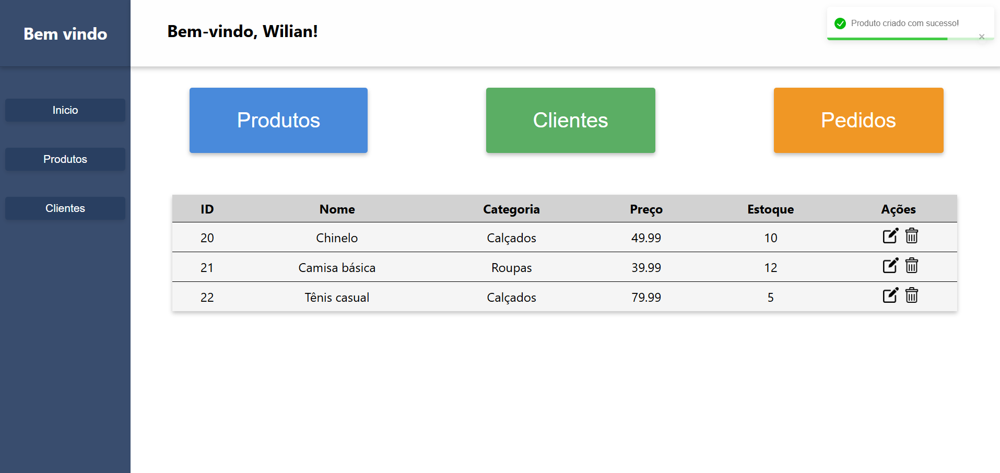

# React + Node.js Product CRUD



## Descrição

CRUD completo de gerenciamento de produtos, desenvolvido com **React** no frontend e **Node.js + Express + MySQL** no backend.
O projeto simula um sistema real de gestão, permitindo criar, listar, atualizar e excluir produtos, com validação de dados e feedback visual para o usuário.

## Tecnologias

- **Frontend:** React, CSS, JavaScript
- **Backend:** Node.js, Express, MySQL
- **Outros:** React Router, React Toastify
- **Controle de versão:** Git e GitHub

## 📁 Estrutura do projeto

```
/CrudTest
 ├── frontend
 └── backend
```

## 🚀 Funcionalidades

- ✅ Cadastro de produtos
- ✅ Listagem de produtos
- ✅ Atualização de produtos
- ✅ Exclusão de produtos
- ✅ Validação de campos
- ✅ Feedback visual com Toast (react-toastify)

## API

- `GET /produtos`
- `POST /produtos`
- `PUT /produtos/:id`
- `DELETE /produtos/:id`

- `GET /clientes`
- `POST /clientes`
- `PUT /clientes/:id`
- `DELETE /clientes/:id`

## 📌 Autor

Desenvolvido por **Wilian Zembrani** 🚀
